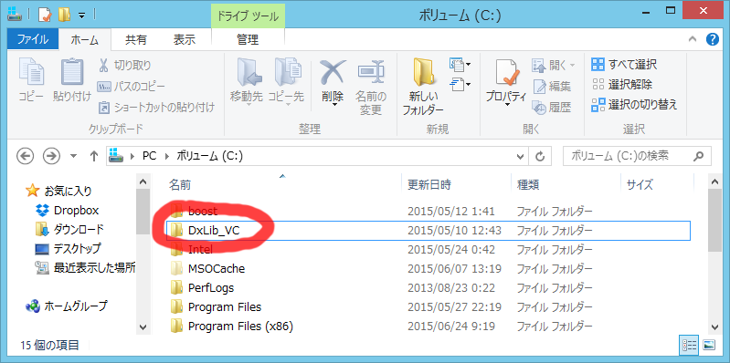
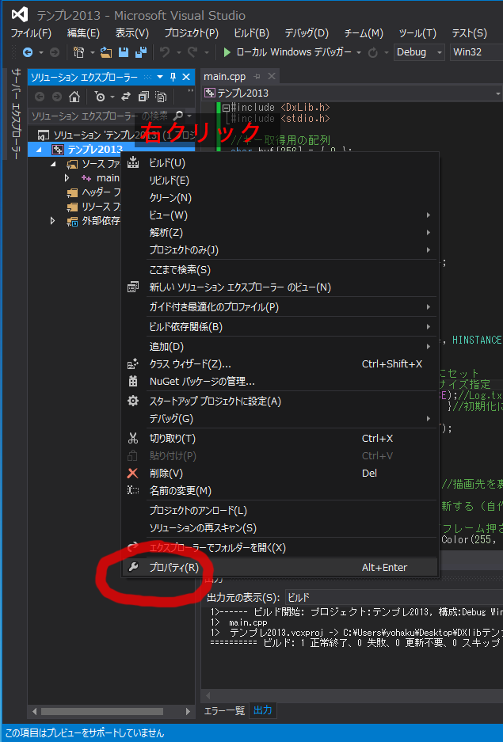
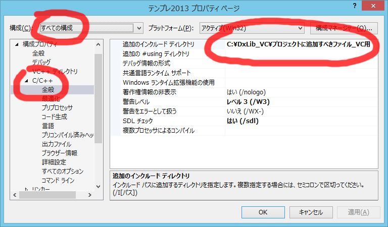
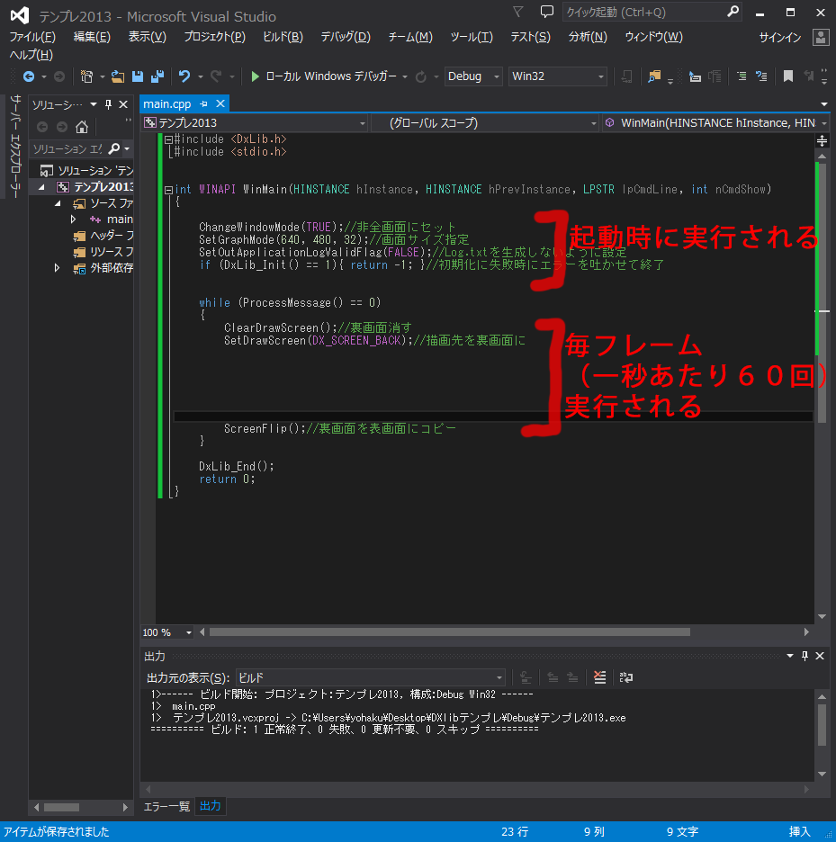
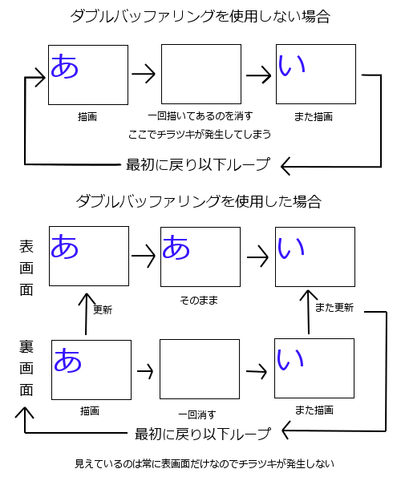
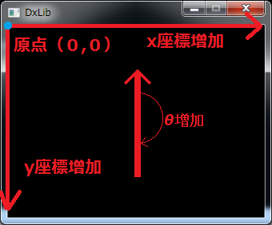
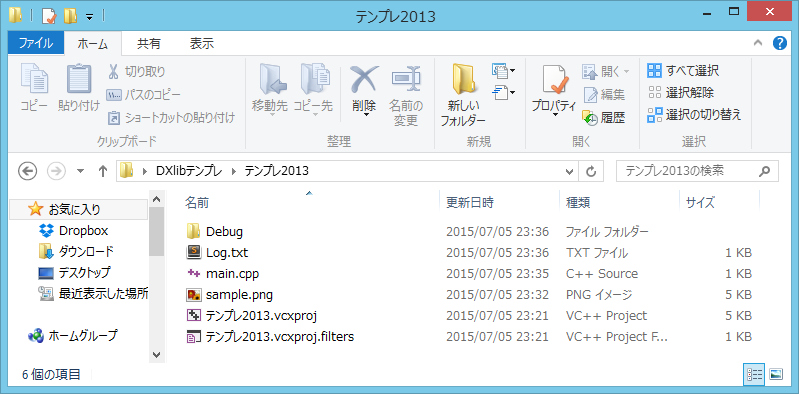
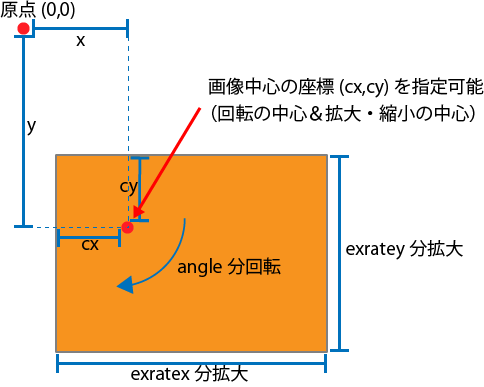
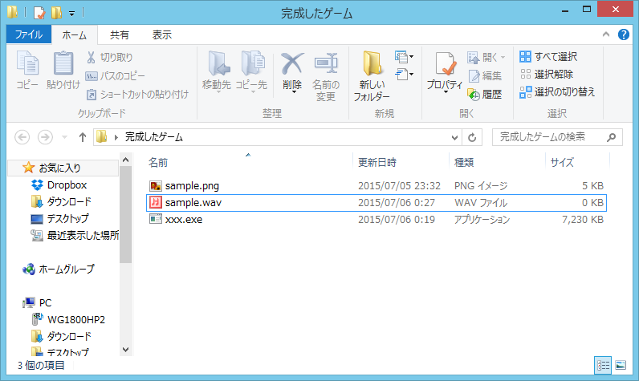

#DxLib導入講座資料

##DXライブラリとは
DxLib(DXライブラリ)とは、画像描画やキー入力などのゲーム制作において面倒なところを肩代わりしてくれる関数ライブラリです。


##今回やること
本講座では、DxLibの基本的な関数を実際に動かしてみます。具体的には以下を行います。  

* 画像描画  
* 文字描画  
* キー・マウス入力状態取得  
* 音再生  

DxLibのVisualStudioのプロジェクトへの設定は、今回は行わず、設定を行ったプロジェクトを配布します。後に参考ページを見て自分で行ってみてください。  


##DXライブラリの導入
1. DXライブラリのダウンロード  
[DXライブラリ置き場 DXライブラリのダウンロード](http://homepage2.nifty.com/natupaji/DxLib/dxdload.html)  
↑から、DXライブラリ VisualC++用(Ver3.14d)をダウンロードしてください。

1. DXライブラリを解凍・配置  
ダウンロードしたらダウンロードしたファイルを解凍してください。（実行すると解凍されます）  
解凍されたファイルを以下のようにC:ドライブ直下に置いてください。  


1. DXライブラリをVisual Studioに適用  
VisualStudioのプロジェクトの設定を行い、DXライブラリを使えるようにします。  
この作業はプロジェクトごとに必要になりますが、設定したプロジェクトのフォルダごとコピーすれば使えるので、テンプレートとなるプロジェクトを作っておくといいと思います。  
[DXライブラリ置き場 VisualStudio Express 2013 for Windows Desktop を使用した場合のDXライブラリの使い方](http://homepage2.nifty.com/natupaji/DxLib/use/dxuse_vc2013express.html)  
このページを参考に、DXライブラリを適用してください。
>今回はDXライブラリを適用したプロジェクトを配布しましたので、それを使ってください。

	* 基本的に以下からプロジェクトの設定を行えます。
	  
	* 基本的に以下の赤丸で囲んだようなところ等を適宜選択して、設定していけばOKです。
	  


##どうやって使っていけばいいか？  
* リファレンスを読む  
関数がわからなければ、公式サイトの以下のリファレンスを読むとよいです。サンプルコードも充実しているので、一度目を通しておき、どのような機能があるのか把握しておくとよいです。  
[ＤＸライブラリ　関数リファレンスページ](http://homepage2.nifty.com/natupaji/DxLib/dxfunc.html)  
ダウンロードして解凍してCドライブ直下に置いたフォルダ内（多分C:\DxLib_VC\help）にも同じリファレンスが入っています。 実際に開いて、ブックマークしておいてください。ネットに繋がっていない状態でもリファレンスを見ることができて便利です。  

* 先輩に聞く  
最初のうちにDXライブラリで詰まるようなところは、CCSの先輩に聞くとだいたい解決すると思います。サ館に行って質問したり、ツイッターで質問してみましょう。質問するときは、「何が分からないのか」「どのような機能を実装したいのか」を、紙などにまとめてから質問してください。  

* ググる  
DXライブラリの関数名や、実装したい機能で検索を行うと、それについて解説しているページや、サンプルコードが出てきます。  
例：文字を複数行で表示してみたい→「文字 複数行」で検索

##フレーム
DXライブラリで作るゲームプログラムでは、人間の目で追いつけない速度で画面を更新しており、パラパラ漫画のように毎秒60回画面を描画することによって、キャラが動いているように見せています。  
フレームとは、パラパラ漫画で言えばコマのことで、DXライブラリでは一秒あたり約60フレームです。
以下に基本的なコード例を示します。while文内が一秒あたり約60回実行されます。
  

##基本的なコード  
```cpp
#include <DxLib.h>
#include <stdio.h>

//
//ここで変数を用意
//


int WINAPI WinMain(HINSTANCE hInstance, HINSTANCE hPrevInstance, LPSTR lpCmdLine, int nCmdShow)
{

	ChangeWindowMode(TRUE);//非全画面にセット
	SetGraphMode(640, 480, 32);//画面サイズ指定
	SetOutApplicationLogValidFlag(FALSE);//Log.txtを生成しないように設定
	if (DxLib_Init() == 1){ return -1; }//初期化に失敗時にエラーを吐かせて終了

	//
	//ここで画像・音を読み込み
	//

	while (ProcessMessage() == 0)
	{
		ClearDrawScreen();//裏画面消す
		SetDrawScreen(DX_SCREEN_BACK);//描画先を裏画面に

		//
		//ここに毎フレーム呼ぶ処理を書く
		//

		ScreenFlip();//裏画面を表画面にコピー
	}

	DxLib_End();
	return 0;
}
```


##ダブルバッファリング  
簡単に言うとダブルバッファリングは画面更新に伴う「ちらつき」を防ぐための技術です。
画面に表示するもの（表画面）と画面には表示しないもの（裏画面）2つの画面をまず用意します。そして、裏画面に全て描画した後にそれを表画面にコピー、裏画面の絵を一回消して再描画、表画面へコピー、……を繰り返すことにより一回消すときにどうしても発生してしまうチラツキを抑えます。具体的には以下のとおりです。
  


##座標系  
DXライブラリの座標系は、左上が(0,0)、x軸の正方向が右、y軸の正方向が下です。  

  


##サンプルコード
それでは、実際にいろいろなプログラムを実行してみましょう。  
以下のサンプルコードを実行しながら解説していきます。  
また、リファレンスを一緒に開いて、それも見ながら解説を聞いてください。  

[ＤＸライブラリ　関数リファレンスページ](http://homepage2.nifty.com/natupaji/DxLib/dxfunc.html)  
ダウンロードして解凍してCドライブ直下に置いたフォルダ内（多分C:\DxLib_VC\help）にも同じリファレンスが入っています。  
わからないことがあったら、サブ講師や隣の人に聞いてください。周りにわからない人がいたら教えてあげてください。  

##画像を描画
画像を描画するには以下を行う。

1. プロジェクトのフォルダ内に画像を配置する（xxx.cpp（ソースコード）などがあるところと同じ階層においてください）  
1. LoadGraph関数を使い画像を読み込む。int型の変数にハンドル（画像の番号みたいなやつ）を記録する
1. グラフィック描画関数に、座標、ハンドルなどを渡し、描画する  
  
  
画像の読み込みを毎フレーム行わないように注意してください。while文の中は、毎フレーム行われる処理です。

```cpp
#include <DxLib.h>
#include <stdio.h>

int handle;//ハンドル用変数を宣言

int WINAPI WinMain( HINSTANCE hInstance , HINSTANCE hPrevInstance , LPSTR lpCmdLine , int nCmdShow )
{
	ChangeWindowMode( TRUE );//非全画面にセット
	SetGraphMode( 640 , 480 , 32 );//画面サイズ指定
	SetOutApplicationLogValidFlag( FALSE ) ;//Log.txtを生成しないように設定
	if(DxLib_Init() == 1){return -1;}//初期化に失敗時にエラーを吐かせて終了

	handle = LoadGraph("sample.png");

	while( ProcessMessage()==0 )
	{
		ClearDrawScreen();//裏画面消す
		SetDrawScreen( DX_SCREEN_BACK ) ;//描画先を裏画面に
		
		DrawGraph(0, 100, handle, 0);//描画

		ScreenFlip();//裏画面を表画面にコピー
	}

	DxLib_End();
	return 0;
}
```


##図形を描画  
DrawCircle,DrawBox,DrawLine関数を使用すると、円や長方形、線を描画することができる。  
当たり判定のデバッグを行うときや、仮のメニュー画面を作るときに使える。  
GetColor関数は、色を取得する関数である。各関数の使い方をリファレンスで見てみて下さい。

```cpp
#include <DxLib.h>
#include <stdio.h>

int WINAPI WinMain( HINSTANCE hInstance , HINSTANCE hPrevInstance , LPSTR lpCmdLine , int nCmdShow )
{
	ChangeWindowMode( TRUE );//非全画面にセット
	SetGraphMode( 640 , 480 , 32 );//画面サイズ指定
	SetOutApplicationLogValidFlag( FALSE ) ;//Log.txtを生成しないように設定
	if(DxLib_Init() == 1){return -1;}//初期化に失敗時にエラーを吐かせて終了


	while( ProcessMessage()==0 )
	{
		ClearDrawScreen();//裏画面消す
		SetDrawScreen( DX_SCREEN_BACK ) ;//描画先を裏画面に

		DrawCircle(100, 100, 30, GetColor(255, 0, 0), 0);
		DrawCircle(300, 100, 30, GetColor(0, 255, 0), 1);
		DrawBox(50, 300, 100, 400, GetColor(0, 0, 255), 1);
		DrawLine(200, 300, 300, 400, GetColor(255, 255, 255), 1);

		ScreenFlip();//裏画面を表画面にコピー
	}

	DxLib_End();
	return 0;
}
```

##文字を描画する
DrawFormatStringを使うと、文字を描画することができる。  
printf関数のように、%dや%fも使うことができる。

```cpp
#include <DxLib.h>
#include <stdio.h>

int WINAPI WinMain( HINSTANCE hInstance , HINSTANCE hPrevInstance , LPSTR lpCmdLine , int nCmdShow )
{
	ChangeWindowMode( TRUE );//非全画面にセット
	SetGraphMode( 640 , 480 , 32 );//画面サイズ指定
	SetOutApplicationLogValidFlag( FALSE ) ;//Log.txtを生成しないように設定
	if(DxLib_Init() == 1){return -1;}//初期化に失敗時にエラーを吐かせて終了

	int hoge = 100;
	double piyo = 3.14;

	while( ProcessMessage()==0 )
	{
		ClearDrawScreen();//裏画面消す
		SetDrawScreen( DX_SCREEN_BACK ) ;//描画先を裏画面に

		DrawFormatString(100, 100, GetColor(255, 255, 255), "aaa %d %f", hoge, piyo);

		ScreenFlip();//裏画面を表画面にコピー
	}

	DxLib_End();
	return 0;
}
```


##何フレーム経過したか描画  
```cpp
#include <DxLib.h>
#include <stdio.h>

int count = 0;

int WINAPI WinMain(HINSTANCE hInstance, HINSTANCE hPrevInstance, LPSTR lpCmdLine, int nCmdShow)
{
	ChangeWindowMode(TRUE);//非全画面にセット
	SetGraphMode(640, 480, 32);//画面サイズ指定
	SetOutApplicationLogValidFlag(FALSE);//Log.txtを生成しないように設定
	if (DxLib_Init() == 1){ return -1; }//初期化に失敗時にエラーを吐かせて終了

	while (ProcessMessage() == 0)
	{
		ClearDrawScreen();//裏画面消す
		SetDrawScreen(DX_SCREEN_BACK);//描画先を裏画面に

		count++;

		DrawFormatString(100, 100, GetColor(255, 255, 255), "frame %d", count);
		DrawFormatString(100, 120, GetColor(255, 255, 255), "sec %d", count / 60);

		ScreenFlip();//裏画面を表画面にコピー
	}

	DxLib_End();
	return 0;
}
```

##何フレーム経過したか描画…できないケース  
以下のように、while文内で変数を宣言すると、whileのループのたびに変数が生成、破棄されるので、表示される値は常に1になってしまいます。C言語講座の「スコープ」の話です。 {} の中で宣言された変数は、{}を抜けると破棄されます。  


！！！！！！！！！以下のコードはいまいち！！というかずっと 1 ！！！！！！！！！！！！！！！！！
```cpp
#include <DxLib.h>
#include <stdio.h>


int WINAPI WinMain(HINSTANCE hInstance, HINSTANCE hPrevInstance, LPSTR lpCmdLine, int nCmdShow)
{
	ChangeWindowMode(TRUE);//非全画面にセット
	SetGraphMode(640, 480, 32);//画面サイズ指定
	SetOutApplicationLogValidFlag(FALSE);//Log.txtを生成しないように設定
	if (DxLib_Init() == 1){ return -1; }//初期化に失敗時にエラーを吐かせて終了

	while (ProcessMessage() == 0)
	{
		ClearDrawScreen();//裏画面消す
		SetDrawScreen(DX_SCREEN_BACK);//描画先を裏画面に

		int count = 0;

		count++;

		DrawFormatString(100, 100, GetColor(255, 255, 255), "frame %d", count);

		ScreenFlip();//裏画面を表画面にコピー
	}

	DxLib_End();
	return 0;
}
```

##マウスの座標を取得・描画する
GetMousePoint関数を使うと、マウスの座標を取得できます。  
GetMousePoint関数は、int型のポインタを引数に取る関数です…が、ポインタがよくわからない場合は、以下のようにmousex,mouseyを用意し、それに&をつけて書いておけばいいと思ってください。

```cpp
#include <DxLib.h>
#include <stdio.h>

int mousex = 0;//マウス座標
int mousey = 0;//マウス座標


int WINAPI WinMain( HINSTANCE hInstance , HINSTANCE hPrevInstance , LPSTR lpCmdLine , int nCmdShow )
{
	ChangeWindowMode( TRUE );//非全画面にセット
	SetGraphMode( 640 , 480 , 32 );//画面サイズ指定
	SetOutApplicationLogValidFlag( FALSE ) ;//Log.txtを生成しないように設定
	if(DxLib_Init() == 1){return -1;}//初期化に失敗時にエラーを吐かせて終了

	while( ProcessMessage()==0 )
	{
		ClearDrawScreen();//裏画面消す
		SetDrawScreen( DX_SCREEN_BACK ) ;//描画先を裏画面に
		
		GetMousePoint( &mousex, &mousey ); //マウス座標更新

		//左上に文字（マウスの座標）を描画
		DrawFormatString(20, 50, GetColor(255, 255, 255), "MX:%3d MY:%3d", mousex, mousey);

		ScreenFlip();//裏画面を表画面にコピー
	}

	DxLib_End();
	return 0;
}
```


##キーの状態を取得する（押しはじめのフレームも取得可能にする場合）
以下のように、buf,keystate配列とkeyupdate関数を用意し、関数を毎フレーム呼ぶことで配列を更新することで、キーが何フレーム押されているかを取得できる。  
KEY_INPUT_Zは、DXライブラリ内部で44にdefineされている。  

1. buf, keystate配列を用意　　
1. keyupdate関数を毎フレームよび、配列の中身を更新  
1. GetHitKeyStateAll関数は、DXライブラリの関数で、キーが押されていれば1, そうでなければ0を受け取った配列の対応した番号に入れる関数。例として、Zキーを押していると、bufの44番目に1、押していなければ0が入る。
1. bufのN番目を見て、数値が1だったらkeystate配列のN番目を +1 し、そうでなければ0にする。
1. こうすることでキーに対応した配列の位置に、そのキーが何フレーム押し続けられているかを入れることができる。    

```cpp
#include <DxLib.h>
#include <stdio.h>

//キー取得用の配列
char buf[256] = { 0 };
int keystate[256] = { 0 };


//キー入力状態を更新する関数
void keyupdate()
{
	GetHitKeyStateAll(buf);
	for (int i = 0; i< 256; i++)
	{
		if (buf[i] == 1){
			keystate[i]++;
		}
		else{
			keystate[i] = 0;
		}
	}
}

int WINAPI WinMain(HINSTANCE hInstance, HINSTANCE hPrevInstance, LPSTR lpCmdLine, int nCmdShow)
{

	ChangeWindowMode(TRUE);//非全画面にセット
	SetGraphMode(640, 480, 32);//画面サイズ指定
	SetOutApplicationLogValidFlag(FALSE);//Log.txtを生成しないように設定
	if (DxLib_Init() == 1){ return -1; }//初期化に失敗時にエラーを吐かせて終了

	while (ProcessMessage() == 0)
	{
		ClearDrawScreen();//裏画面消す
		SetDrawScreen(DX_SCREEN_BACK);//描画先を裏画面に

		keyupdate();//キー入力状態を更新する（自作関数）

		//keystate配列には、各キーが何フレーム押され続けているかが入っている
		DrawFormatString(100, 100, GetColor(255, 255, 255), "Z KEY %d", keystate[KEY_INPUT_Z]);
		DrawFormatString(100, 120, GetColor(255, 255, 255), "X KEY %d", keystate[KEY_INPUT_X]);

		if (keystate[KEY_INPUT_Z] > 0){
			DrawCircle(320, 240, 32, GetColor(255, 0, 0));
		}
		if (keystate[KEY_INPUT_X] > 0){
			DrawCircle(320, 340, 32, GetColor(0, 255, 0));
		}

		ScreenFlip();//裏画面を表画面にコピー
	}

	DxLib_End();
	return 0;
}
```

##keyupdate関数使用例:円を動かす
先程の例のように、buf, keystate配列、keyupdate関数を用意することで、keystate配列の中身を見て、それが1と等しい時に処理を実行するとキーが押され始めたフレームに、0より大きいフレームに処理を実行するとキーが押されているフレームに処理を実行できる。

```cpp
#include <DxLib.h>
#include <stdio.h>

//キー取得用の配列
char buf[256] = { 0 };
int keystate[256] = { 0 };


//キー入力状態を更新する関数
void keyupdate()
{
	GetHitKeyStateAll(buf);
	for (int i = 0; i< 256; i++)
	{
		if (buf[i] == 1) keystate[i]++;
		else keystate[i] = 0;
	}
}

int x = 100;

int WINAPI WinMain(HINSTANCE hInstance, HINSTANCE hPrevInstance, LPSTR lpCmdLine, int nCmdShow)
{

	ChangeWindowMode(TRUE);//非全画面にセット
	SetGraphMode(640, 480, 32);//画面サイズ指定
	SetOutApplicationLogValidFlag(FALSE);//Log.txtを生成しないように設定
	if (DxLib_Init() == 1){ return -1; }//初期化に失敗時にエラーを吐かせて終了

	while (ProcessMessage() == 0)
	{
		ClearDrawScreen();//裏画面消す
		SetDrawScreen(DX_SCREEN_BACK);//描画先を裏画面に

		keyupdate();//キー入力状態を更新する（自作関数）

		//keystate配列には、各キーが何フレーム押され続けているかが入っている
		DrawFormatString(100, 100, GetColor(255, 255, 255), "Z KEY %d", keystate[KEY_INPUT_Z]);
		DrawFormatString(100, 120, GetColor(255, 255, 255), "X KEY %d", keystate[KEY_INPUT_X]);

		if (keystate[KEY_INPUT_Z] > 0){
			x += 1;
		}
		if (keystate[KEY_INPUT_X] == 1){
			x += 30;
		}

		DrawCircle(x, 200, 32, GetColor(255, 0, 0));

		ScreenFlip();//裏画面を表画面にコピー
	}

	DxLib_End();
	return 0;
}
```

##音を再生する
音の再生の仕方

1. プロジェクトのフォルダ内に音素材(wav,ogg,mp3など)を配置する（xxx.cpp（ソースコード）などがあるところと同じ階層においてください）  
1. LoadSoundMem関数を使い音素材を読み込む。int型の変数にハンドルを記録する
1. 音再生関数に、座標、ハンドルなどを渡し、描画する  

PlaySoundMem関数の第二引数の値で再生オプションが指定できます。DX_PLAYTYPE_BACKは一回だけ、DX_PLAYTYPE_LOOPはループで再生します。DX_PLAYTYPE_NORMALは再生中他の実行が止まる謎のオプションで、使いません。

```cpp
#include <DxLib.h>
#include <stdio.h>

//キー取得用の配列
char buf[256] = { 0 };
int keystate[256] = { 0 };


//キー入力状態を更新する関数
void keyupdate()
{
	GetHitKeyStateAll(buf);
	for (int i = 0; i< 256; i++)
	{
		if (buf[i] == 1) keystate[i]++;
		else keystate[i] = 0;
	}
}

int handle;

int WINAPI WinMain(HINSTANCE hInstance, HINSTANCE hPrevInstance, LPSTR lpCmdLine, int nCmdShow)
{

	ChangeWindowMode(TRUE);//非全画面にセット
	SetGraphMode(640, 480, 32);//画面サイズ指定
	SetOutApplicationLogValidFlag(FALSE);//Log.txtを生成しないように設定
	if (DxLib_Init() == 1){ return -1; }//初期化に失敗時にエラーを吐かせて終了

	handle = LoadSoundMem("sample.wav");

	while (ProcessMessage() == 0)
	{
		ClearDrawScreen();//裏画面消す
		SetDrawScreen(DX_SCREEN_BACK);//描画先を裏画面に

		keyupdate();//キー入力状態を更新する（自作関数）

		//keystate配列には、各キーが何フレーム押され続けているかが入っている
		DrawFormatString(100, 100, GetColor(255, 255, 255), "Z KEY %d", keystate[KEY_INPUT_Z]);
		
		if (keystate[KEY_INPUT_Z] == 1){
			PlaySoundMem(handle, DX_PLAYTYPE_BACK);
		}

		ScreenFlip();//裏画面を表画面にコピー
	}

	DxLib_End();
	return 0;
}
```


##画像を読み込めないケース  
画像を描画できない場合は、以下のケースが考えられます。  

* 画像のデータ(pngなど)が正しい場所にない  
* DxLib_Init関数の前にLoadGraph関数を読んでいる  
* 画面外に描画している  
* 画像の名前を間違っている（今回だったらsample.pngをミスタイプして、sapmle.pngと打っている場合など）  

！！！！！！！！！以下のサンプルコードは、そのままコピペしても何も描画されない！！！！！！！！！！！！！！  
例：DxLib_Init関数の前にLoadGraph関数を読んでいる場合

```cpp
#include <DxLib.h>
#include <stdio.h>

int handle;

int WINAPI WinMain( HINSTANCE hInstance , HINSTANCE hPrevInstance , LPSTR lpCmdLine , int nCmdShow )
{
	handle = LoadGraph("sample.png");

	ChangeWindowMode( TRUE );//非全画面にセット
	SetGraphMode( 640 , 480 , 32 );//画面サイズ指定
	SetOutApplicationLogValidFlag( FALSE ) ;//Log.txtを生成しないように設定
	if(DxLib_Init() == 1){return -1;}//初期化に失敗時にエラーを吐かせて終了


	while( ProcessMessage()==0 )
	{
		ClearDrawScreen();//裏画面消す
		SetDrawScreen( DX_SCREEN_BACK ) ;//描画先を裏画面に
		
		DrawGraph(0, 100, handle, 0);

		ScreenFlip();//裏画面を表画面にコピー
	}

	DxLib_End();
	return 0;
}
```

##画像の透明度を指定して描画 
画像の透明度を指定して描画するには、SetDrawBlendModeを使う。  
透明度の値の設定は再度関数を呼ぶまでそのままになるので、DrawGraph関数を読んで画像を描画する前にSetDrawBlendMode関数を呼び、いちいち透明度を指定しなければいけない。  

```cpp
#include <DxLib.h>
#include <stdio.h>


int mousex = 0;//マウス座標
int mousey = 0;//マウス座標


int WINAPI WinMain(HINSTANCE hInstance, HINSTANCE hPrevInstance, LPSTR lpCmdLine, int nCmdShow)
{

	ChangeWindowMode(TRUE);//非全画面にセット
	SetGraphMode(640, 480, 32);//画面サイズ指定
	SetOutApplicationLogValidFlag(FALSE);//Log.txtを生成しないように設定
	if (DxLib_Init() == 1){ return -1; }//初期化に失敗時にエラーを吐かせて終了

	int handle = LoadGraph("sample.png");

	while (ProcessMessage() == 0)
	{
		ClearDrawScreen();//裏画面消す
		SetDrawScreen(DX_SCREEN_BACK);//描画先を裏画面に

		GetMousePoint(&mousex, &mousey); //マウス座標更新

		SetDrawBlendMode(DX_BLENDMODE_ALPHA, 255);
		DrawFormatString(20, 20, GetColor(255, 255, 255), "mousex:%d", mousex);

		SetDrawBlendMode(DX_BLENDMODE_ALPHA, mousex);
		DrawGraph(100, 100, handle, 0);

		ScreenFlip();//裏画面を表画面にコピー
	}

	DxLib_End();
	return 0;
}
```

##画像を拡大・縮小して描画  
画像を拡大・縮小して描画するには、 DrawRotaGraph関数を使う。  
回転角はラジアンで指定する。

```
#include <DxLib.h>
#include <stdio.h>


int mousex = 0;//マウス座標
int mousey = 0;//マウス座標

int WINAPI WinMain(HINSTANCE hInstance, HINSTANCE hPrevInstance, LPSTR lpCmdLine, int nCmdShow)
{

	ChangeWindowMode(TRUE);//非全画面にセット
	SetGraphMode(640, 480, 32);//画面サイズ指定
	SetOutApplicationLogValidFlag(FALSE);//Log.txtを生成しないように設定
	if (DxLib_Init() == 1){ return -1; }//初期化に失敗時にエラーを吐かせて終了

	int handle = LoadGraph("sample.png");

	while (ProcessMessage() == 0)
	{
		ClearDrawScreen();//裏画面消す
		SetDrawScreen(DX_SCREEN_BACK);//描画先を裏画面に

		GetMousePoint(&mousex, &mousey); //マウス座標更新


		double exrate = mousex / 100.0;
		double angle = mousey / 100.0;

		DrawFormatString(20, 20, GetColor(255, 255, 255), "mousex:%d", mousex);
		DrawFormatString(20, 40, GetColor(255, 255, 255), "mousey:%d", mousey);
		DrawFormatString(20, 60, GetColor(255, 255, 255), "exrate:%f", exrate);
		DrawFormatString(20, 80, GetColor(255, 255, 255), "angle:%f", angle);


		DrawRotaGraph(320, 240, exrate, angle, handle, 0);

		ScreenFlip();//裏画面を表画面にコピー
	}

	DxLib_End();
	return 0;
}
```


##画像を拡大・縮小して描画　その2  
DrawRotaGraph3を使うと、拡大縮小回転指定、及び画像の中央の座標を指定してでき、またx,y方向への拡大率を別々に指定できる。  
以下のプログラムでは、マウスの座標によってx,y方向への拡大率を指定している。  

```cpp
#include <DxLib.h>
#include <stdio.h>


int mousex = 0;//マウス座標
int mousey = 0;//マウス座標

int WINAPI WinMain(HINSTANCE hInstance, HINSTANCE hPrevInstance, LPSTR lpCmdLine, int nCmdShow)
{

	ChangeWindowMode(TRUE);//非全画面にセット
	SetGraphMode(640, 480, 32);//画面サイズ指定
	SetOutApplicationLogValidFlag(FALSE);//Log.txtを生成しないように設定
	if (DxLib_Init() == 1){ return -1; }//初期化に失敗時にエラーを吐かせて終了

	int handle = LoadGraph("sample.png");

	while (ProcessMessage() == 0)
	{
		ClearDrawScreen();//裏画面消す
		SetDrawScreen(DX_SCREEN_BACK);//描画先を裏画面に

		GetMousePoint(&mousex, &mousey); //マウス座標更新


		double exratex = mousex / 100.0;
		double exratey = mousey / 100.0;

		DrawFormatString(20, 20, GetColor(255, 255, 255), "mousex:%d", mousex);
		DrawFormatString(20, 40, GetColor(255, 255, 255), "mousey:%d", mousey);
		DrawFormatString(20, 60, GetColor(255, 255, 255), "exratex:%f", exratex);
		DrawFormatString(20, 80, GetColor(255, 255, 255), "exratey:%f", exratex);


		DrawRotaGraph3(320, 240, 20, 20, exratex, exratey, 0.0, handle, 0);
		DrawCircle(320, 240, 6, GetColor(255, 0, 0));//拡大の中心を赤丸で描画

		ScreenFlip();//裏画面を表画面にコピー
	}

	DxLib_End();
	return 0;
}
```

##よく使う画像描画関数
それぞれリファレンスを見て、比較してみてください。

* DrawGraph  
拡大縮小回転なしで単純に描画。座標は画像左上を指定する。  

* DrawRotaGraph  
拡大縮小回転指定して描画。座標は画像中央を指定する。  

* DrawRotaGraph3  
拡大縮小回転指定、及び画像の中央の座標を指定して描画。またx,y方向への拡大率を別々に指定できる。

以下にDrawRotaGraph3の概略図を示します。  
  


##その他  
* ジョイパッドからの入力を受け取る  
→GetJoypadInputState関数を使う  

* 画像を分割して読み込みたい  
→LoadDivGraph関数を使う

##ゲームが完成したら
* Releaseビルドを行うと、コンパイルに時間がかかりますが、高速に動作するプログラムを作成できます。  
* ファイルの暗号化（画像ファイル・音ファイルを外から見られないようにする）が可能です。
* 配布する際は以下の様なフォルダ構成にしてください。Releaseビルドした際はReleaseフォルダ内にできたexeファイル、使用した画像素材、音素材がフォルダ内にあればプログラムは動作します。  


ここらへんはゲームが完成したらまた先輩に聞いてみてください。  

##デバッグ手法  
* DrawFormatStringで変数を出力する  
よく使われている変数の中身、自機の座標などを表示しておくと、バグに気づきやすくなると思います。  

* DrawCircle,DrawBoxを使う  
座標や、当たり判定をこれらで可視化し、デバッグを行うことができます。また、画像素材がない場合、これらでゲームの枠組みだけ作っておくことが可能です。

* VisualStudioのブレークポイントを使う  
慣れてきたら、先輩にこの機能を聞いてみてください。プログラムの指定したところで、動作を止め、変数の中身を見ることが可能です。


##課題  
* マウスの位置に画像を描画せよ。  

* 上下左右キーで対応した方向に画像を動かせ。  

* リファレンスを読む  
[DXライブラリ置き場 DXライブラリ　関数リファレンスページ](http://homepage2.nifty.com/natupaji/DxLib/dxfunc.html)  
このページをざっくり読んでみてください。特に、「図形描画関数」「グラフィックデータ制御関数」のところをよく読んでみてください。

* プロジェクトの設定  
公式サイトの以下のページを参考に、プロジェクトの設定を自分で行ってみてください。  
[DXライブラリ置き場 VisualStudio Express 2013 for Windows Desktop を使用した場合のDXライブラリの使い方](http://homepage2.nifty.com/natupaji/DxLib/use/dxuse_vc2013express.html)  
プロジェクトの設定を行うことができたら、sample.pngを表示と、sample.wavを再生を行ってみてください。

