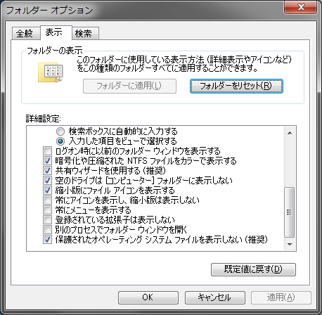
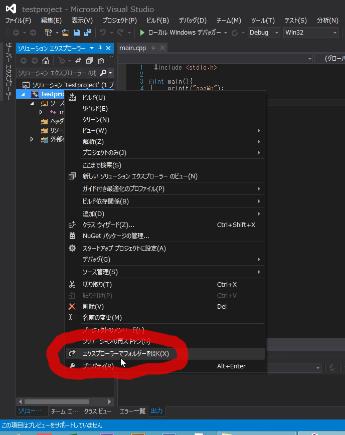

#DxLib導入講座：予備知識

##DXライブラリの特徴
* 使用可能な言語はC, C++, C#。C#で書くと若干動作が重くなる。
* Javaなどで組んだゲームに比べて、高速で動作する。(たくさんのキャラや、弾を出しても処理が重くならない)

##なぜDXライブラリを使うのか？
DXライブラリは、2001年（14年前）に初版が発表されたライブラリです。
CCS内では、DXライブラリがよく使われており、先輩や同学年の人からDXライブラリの知識を聞くことができるので、みんなDXライブラリを使っている感じです。

##DXライブラリで作りやすいもの
* 簡単なミニゲーム  

* シューティング  
たくさん弾の出るようなシューティングも、DXライブラリは動作が軽いので作ることが出来ます。  

* 音ゲー、アクションゲーム  

##DXライブラリで作らないほうが簡単に作れそうなもの
* 3Dのゲーム  
Unityなどを使ったほうが、簡単に作れるかもしれません。  

* ノベルゲーム(ギャルゲー的なもの）  
吉里吉里などのツールを使ったほうが、簡単に作れると思います。  

##DXライブラリ以外のゲーム用ライブラリ、開発環境
* Unity  
* Siv3D  
* DirectX  
* 吉里吉里  

##今後、どうやってプログラミングの学習をしていけばいいか？
何をしたいかによって、何をすればいいかが変わります。大まかな例と、学習するのに役立ちそうな知識を書いておきます。
何がしたいかが決まっているなら、twitterや会室で先輩にいろいろ話を聞いてみると思います。

* ツールを作りたい  
VisualStudioと、C#を使うと、簡単なツールを作ることが出来ます。例えば、サークルの本を管理するツール（本の名前、ジャンルを入力→データベースに登録、データベースを見やすく表示）を作ることが出来ます。  
また、シューティングやアクションゲームのステージエディタを作ることが出来ます。  

* なんとなくゲームを作ってみたい  
CCSの先輩に質問できる環境がある前提なら、とりあえず、クソゲーでいいので、ミニゲームを作ってみるといいと思います。  

* DXライブラリで大規模なゲームを作りたい  
C++と、オブジェクト指向を学ぶと良いと思います。  
「ロベールのC++」というサイト、本があるので、それをやってみるといいと思います。    

* プログラミングコンテスト  
プログラミングコンテストとは、与えられた問題に対して、効率的に解答を返すプログラムを作成するコンテストです。  

* 3Dのゲームを作りたい  
Unityを触ってみることをおすすめします。Unityの入門書籍を一冊買って、やってみるとよいです。  

##VisualStudioのプロジェクトについて
これまでVisualStudioでプログラムを書いていましたが、内部でファイルがどのように配置されているか、例えばソースコード（main.cppなど）がパソコンのどこに保存されているか意識したことはありますか？  
DXライブラリの導入について解説する前に、そこら辺の知識について解説していきます。  
今回は、一旦DXライブラリは置いておいて、適当なコンソールアプリケーションのプロジェクトをVisualStudioで作って、それの中身を見ることで、プロジェクトとは何か、プロジェクトがどんな感じになってるかを見てみようと思います。  

1. 拡張子の表示  
プロジェクトを説明する前に、コンピューターで拡張子を表示してください。  
拡張子とは、ファイルの末尾につくもので、コンピューターはこれに応じてそのファイルをどのソフトで開くかを決めます。  
例として、xxx.pngだったら多分windowsフォトビューワーで開かれますし、xxx.txtだったらメモ帳で開かれます。    
拡張子を表示するには、コントロールパネル開く→右上とかで「フォルダー」で検索→「フォルダー オプション」開く→「表示」タブ→「登録されている拡張子は表示しない」のチェックボックスを外す。  
(エクスプローラー開いて、altキー押して「ツール」→「フォルダオプション」でも行けます)  

1. プロジェクトを作成する  
C言語講座でいつもやっていたとおり、コンソールアプリケーションのプロジェクトを作成してみてください。プロジェクトの名前は、「testproject」にしてください。  

1. 適当なソースを追加する  
main.cppというソースを、ソースファイルに追加してください。コードの中身は空でOKです。  

1. フォルダを見てみる  
このようにすると、多分マイドキュメントのVisual Studio 2013\Projectsフォルダ内に、「testproject」が生成されていると思います。（プロジェクトを作る場所を変えていればそこに作られます）  
プロジェクト名を右クリックし、「エクスプローラーでフォルダを開く」を選択すると、エクスプローラー（いつも使っている、ファイルを見たり移動できるやつ）で、プロジェクトがあるフォルダを開くことが出来ます。  

1. フォルダの中身を見てみる  
開かれたフォルダの中を探してみると、main.cppがあると思います。  
また、testproject.slnを開くと、VisualStudioでプロジェクトが開きます。（二重に開かないように注意！）  
  
1. コンパイルしてみる  
main.cppを以下の内容に書き換え、コンパイルしてみてください。  

		#include <stdio.h>
		int main(){
			printf("aaa\n");
			return 0;
		}
コンパイルすると、aaaと出力されるプログラムが作成され、それが自動的に実行されます。  

1. 再度フォルダを見てみる  
「Debug」フォルダができていると思います。その中に、「testproject.exe」があると思います。コンパイルによってこれが生成され、自動的に実行されました。  
「testproject.exe」をダブルクリックしてみると、実行されると思います。  

プロジェクトとは、ソースコードなど、プログラムの作成に必要な要素の集まりのことを指します。実際には、プロジェクト名と同じ名前のフォルダが作られており、そこにソースコードなどが生成されています。xxx.slnを開くと、プロジェクトを開くことが出来ます。    
VisualStudioを操作すると、プロジェクトの内部でファイルが生成されたり実行されたりと、様々な操作が自動的に行われています。  

